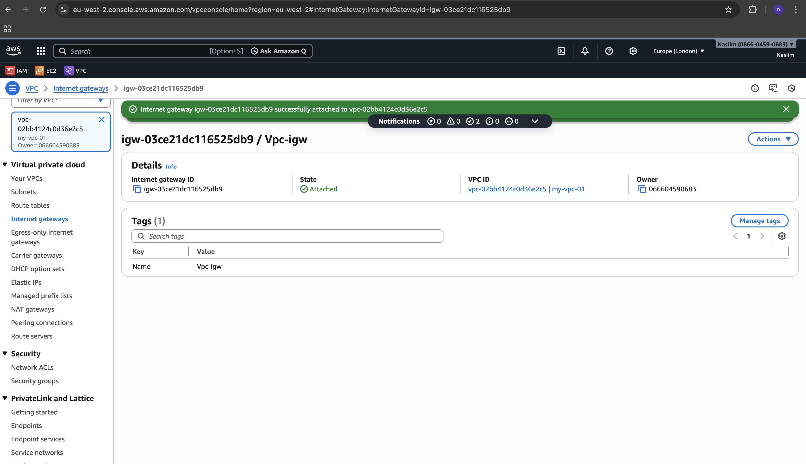
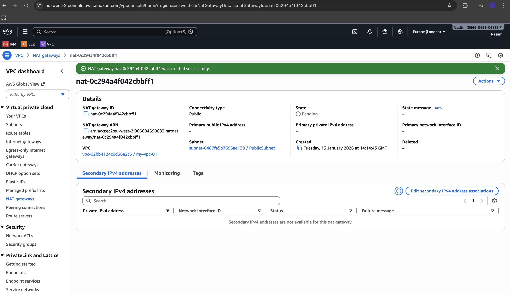
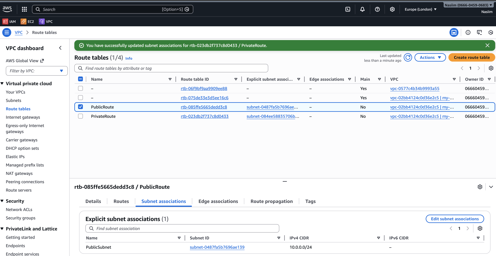
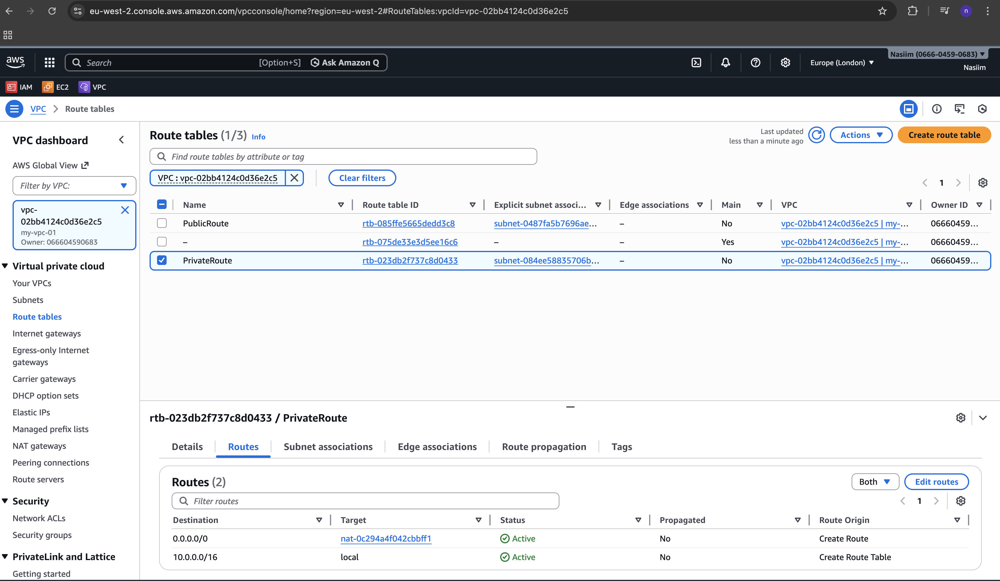
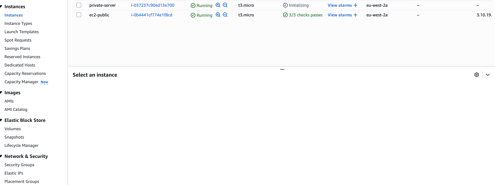
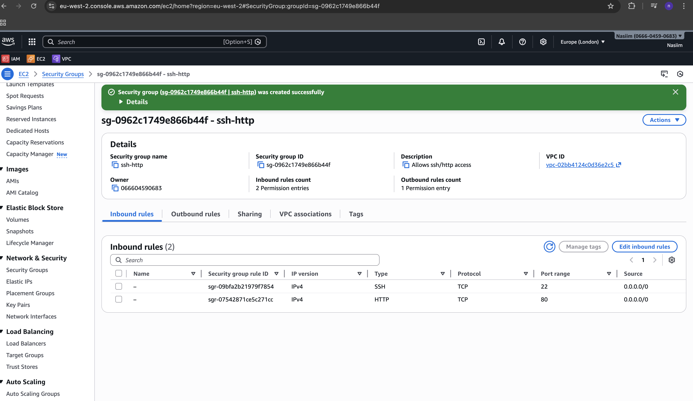

AWS Custom VPC Deployment
1. VPC Setup

Created a custom VPC with CIDR block 10.0.0.0/16

Created one public and private subnet

2. Internet Access

Created and attached an Internet Gateway (IGW) to the VPC

Allocated an Elastic IP

Created a NAT Gateway in the public subnet using the Elastic IP

3. Route Tables

Created a public route table

Added a default route (0.0.0.0/0) pointing to the Internet Gateway

Associated it with the public subnet

Created a private route table

Added a default route (0.0.0.0/0) pointing to the NAT Gateway and associated it with the private subnet

4. EC2 Instances

Launched a public EC2 instance in the public subnet with a public IP address & launched a private EC2 instance in the private subnet without a public IP address

5. Security Groups

Configured a public EC2 security group

Allowed SSH and HTTP access only from my IP address

Configured a private EC2 security group

Allowed internal access only from the public EC2 instance or bastion host

Bastion Host

Deployed a bastion host in the public subnet to securely access the private EC2 instance

